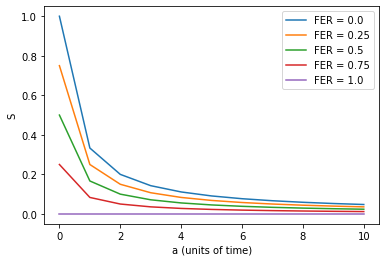
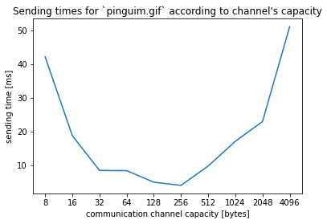

% Redes de Computadores - Ligação de dados
% Miguel Rodrigues (up201906042@edu.fe.up.pt); Nuno Castro (up202003324@edu.fe.up.pt)

\newpage

## Sumário
Este projeto foi desenvolvido no âmbito da unidade curricular de Redes de Computadores e visa a implemetação de um protocolo de ligação de dados e testando-o com uma aplicação de transferência de ficheiros.

## 1. Introdução
Existem inúmeras motivações para que existam mecanismos de transferência de dados entre computadores diferentes, por exemplo, para comunicar à distância. Além disso, é fundamental que essa transferência de dados decorra sem qualquer tipo de erros e de uma forma confiável - esta é, indubitavelmente, a principal motivação para a realização deste pequeno projeto. 

Neste primeiro trabalho prático foi-nos proposto a implementação de um protocolo para a troca de dados entre 2 computadores ligados por uma porta série. As principais tecnologias utilizadas foram a linguagem C, a porta série RS-232 e ainda a *API* programática do *Linux*.

## 2. Arquitetura e Estrutura de código
A impelmentação do protocolo pode ser dividido em diferentes unidades lógicas cada uma independente entre si. Deste modo, temos um protocolo para a aplicação onde uma das partes, isto é o emissor comunica com o recetor usando uma interface que oferece uma abstração à camada de ligação de dados entre os dois programas.

Como foi expresso no parágrafo anterior, o código encontra-se divido de modo a proporcionar diferentes camadas de abstração, isto significa que as diferentes unidades lógicas são independentes entre si. No nosso caso, essa independência é garantida com recurso à disposição do código em diferentes ficheiros - sobretudo de *header files*, mas também com o uso da *keyword* `static` nas declarações das funções que são internas a uma determinada unidade lógica, para que só aí possam ser utilizadas e, simultaneamente, estar escondidas do restante código.

No que concerne à estrutura dos ficheiros, esta é muito simples. Os ficheiros `protocol.h` e `protocol.c` representam a camada de ligação de dados, depois os ficheiros `sender.c` e `receiver.c` representam a camada da aplicação e, finalmente, os ficheiros `utils.h` e `utils.c` que contêm as definições das funções utilitárias.

Para utilizar os 2 programas basta executar um dos seguintes comandos, de acordo com o fluxo de transmissão, em cada um dos dispositivos:

* Para o recetor
```sh 
$ recv <num. da porta> <nome do ficheiro a receber>
```

* Para o recetor
```sh 
$ sndr <num. da porta> <nome do ficheiro a enviar>
```

## 3. Protocolo de ligação de dados
De acordo com o enunciado proposto, devem ser implementadas 4 funções que formam uma *API* a ser usada pelas aplicações, quer do emissor, quer do recetor. Eis os cabeçalhos dessa *API*:

```c 
int llopen(int port, const uint8_t addr);
ssize_t llwrite(int fd, uint8_t *buffer, ssize_t len);
ssize_t llread(int fd, uint8_t *buffer);
int llclose(int fd);
```

### 3.1 `int llopen(int port, const uint8_t addr)` { #llopen }
Abre o canal de comunicações fornecendo o respetivo identificador. A aplicação deve fornecer o número associado à porta série e ainda um valor de modo a identificar de que "lado" da ligação se encontra. Os valores possíveis são `RECEIVER` e `TRANSMITTER` e estão definidos no ficheiro `protocol.h`:

```c
#define RECEIVER 0x01
#define TRANSMITTER 0x03
```

### 3.2 `ssize_t llwrite(int fd, uint8_t *buffer, ssize_t len)` { #llwrite }
Escreve os dados contidos no `buffer` no canal de comunicações. Retorna o número de *bytes* escritos no canal, ou então um valor negativo em caso de erro.

### 3.3 `ssize_t llread(int fd, uint8_t *buffer)`
Lê os dados disponíveis no canal de comunicações, escrevendo-os no `buffer` passado como argumento. Retorna o valor de *bytes* lidos, ou então um valor negativo em caso de erro.

### 3.4 `int llclose(int fd)` { #llclose }
Fecha o canal de comunicações.

### 3.5 Opções { #opcoes }
O protocolo permite que se configurem algumas opções (em tempo de compilação) a partir do ficheiro `makefile`, são elas:

| Opção | Descrição |
| --- | ----------- |
| `BAUDRATE` | Número de símbolo que fluem no canal de comunicações por segundo. |
| `TOUT` | Número de segundos de espera, no emissor, sem uma resposta do recetor até se desencadear uma retransmissão. |
| `TPROP` | Número de segundos de espera no recetor de modo a simular um atraso no [tempo de propagação](#estatisticas) de uma trama. |
| `MAX_RETRIES` | Número máximo de tentativas de retransmissão até que o emissor desista de retransmitir. |
| `MAX_PACKET_SIZE` | Tamanho máximo, em *bytes*, para os pacotes da aplicação |
: Opções de compilação disponíveis no ficheiro `makefile`.

### 3.6 Detalhes de implementação
Na implementação do protocolo da ligação de dados os principais desafios foram as implementações dos mecanismos de transparência e deteção de erros nos dados transmitidos e do mecanismo de leitura de dados, sobretudo por causa da panóplia de nuances a ter em conta.

O fluxo de execução é bastante simples, com a característica de que na nossa implementação é o emissor quem toma a iniciativa. Deste modo, o emissor começa por enviar o comando `SET` ficando logo de seguida à espera de uma resposta do recetor. Já do lado do recetor, o programa aguarda pela receção da trama `SET` e envia a resposta - uma trama do tipo `UA`.

O envio das tramas de supervisão é feito pela função `send_frame_us(int fd, uint8_t cmd, uint8_t addr)` onde `fd` descreve o indentificador do canal de comunicações, `cmd` o valor a ser enviado no campo de comando e `addr` que descreve quem envia a trama. Os valores possíveis para `addr` são os mesmos que os da função [`llopen`](#llopen). Nos mesmo moldes, para a `cmd` os valores possíveis são:

```c 
typedef enum { SET, DISC, UA, RR_0, REJ_0, RR_1, REJ_1 } frameCmd;
```

A construção das tramas de supervisão fica clara com o seguinte excerto de código:

```c
unsigned char frame[5];
frame[0] = frame[4] = FLAG;
frame[1] = addr;
frame[2] = cmds[cmd];
frame[3] = frame[1] ^ frame[2];
```

Por outro lado, a receção das tramas de supervisão (e de informação) é digerida na função `read_frame_us(int fd, const uint8_t cmd_mask, const uint8_t addr)`. Esta função é mais complexa que a anterior, na medida em que existe uma máquina de estados para intrepertar cada *byte* de informação lido - isto acontece porque há a necessidade de se ler os dados que chegam *byte* a *byte*. Aqui, os parâmetros, apesar de terem nomes semelhantes, tomam uma intrepertação ligeiramente diferente. Assim, `fd` é o identificador do canal de comunicações, `cmd_mask` é uma máscara de *bits* para permitir que com a mesma função seja possível ler um valor dentro um conjunto valores que possam ocorrer - isto prova-se útil quando existem múltiplas possibilidades de resposta ao envio de uma trama de informação - por último, o valor `addr` representa o valor do lado que enviou a trama.

Depois, o envio e a codificação das tramas de informação é feito pelas funções `write_data` e `encode_data` chamadas por [`llwrite`](#llwrite). No outro lado da comunicação, em [`llread`](#llread), temos a leitura que é intrepertada com recurso a máquina de estado - muito semelhante à presente em `send_frame_us` - e a descodificação que é da responsabilidade da função `decode_data` No fim, após o envio de todos os dados, a conexão é terminada com a chamada a [`llclose`](#llclose).

Alguns excertos de código relevantes são os seguintes:

* As funções `encode_data` e `decode_data` que implementam o mecanismo de transparência de dados, muito importante, na medida em que permite que valores com significado especial possam ocorrer ao longo da informação trasmitida.
```c 
static ssize_t
encode_data(uint8_t **dest, const uint8_t *src, ssize_t len)
{
        ssize_t i, j;
        uint8_t bcc = src[0];
        for (i = 1; i < len; i++)
                bcc ^= src[i];

        ssize_t inc = 0;
        for (i = 0; i < len; i++)
                inc += ESCAPED_BYTE(src[i]);

        ssize_t nlen = len + inc + ESCAPED_BYTE(bcc) + 1;
        *dest = (uint8_t *)malloc(nlen);
        passert(dest != NULL, "protocol.c :: malloc", -1);

        for (i = 0, j = 0; j < len; i += ESCAPED_BYTE(src[j]) + 1, j++)
                encode_cpy(*dest, i, src[j]);
        encode_cpy(*dest, len + inc, bcc);

        return nlen;
}

static ssize_t
decode_data(uint8_t *dest, const uint8_t *src, ssize_t len)
{
        ssize_t i, j;
        ssize_t dec = 0;
        for (i = 0; i < len; i++)
                dec += IS_ESCAPE(src[i]);

        for (i = 0, j = 0; j < len - dec; i++, j++)
            dest[j] = IS_ESCAPE(src[i]) ? (src[++i] ^ KEY) : src[i];

        return len - dec;
}
```

* A função `recv_send_response` que averigua se o campo de proteção de dados está correto e que envia a resposta mais adequada ao emissor. Esta função é chamada por [`llread`](#llread).
```c
static int
recv_send_response(int fd, const uint8_t *buffer, const ssize_t len)
{
        ssize_t i;
        uint8_t bcc = buffer[0], expect_bcc = buffer[len-1];
        for (i = 1; i < len - 1; i++)
                bcc ^= buffer[i];

        uint8_t cmd;
        cmd = sequence_number ? RR_1 : RR_0;
        if (bcc != expect_bcc)
                cmd = sequence_number ? REJ_1 : REJ_0;

        send_frame_us(fd, cmd, RECEIVER);
        return (bcc == expect_bcc) ? len : -1;
}
```

## 4. Protocolo de aplicação
Como vimos na secção anterior, o protocolo da ligação de dados carateriza-se por estar mais a baixo no modelo *OSI* do que o protocolo da aplicação. Este protocolo é mais simples e recorre à *API* descrita em cima para transferir dados. 

No nosso caso implementamos 2 aplicações que representam o recetor e o transmissor dos dados. Em ambos os programas a primeira ação a ser efetuada é a abertura do canal de comunicações com a chamada a [`llopen`](#llopen). Depois, ocorre uma divergência na lógica dos 2 programas. Comecemos pelo emissor, que envia um primeiro pacote de controlo com o valor `START` no campo de controlo e o tamanho do ficheiro, depois lê pequenos fragmentos do ficheiro fornecido como argumento e envia os respetivos pacotes de dados finalizando com um pacote de controlo semelhante ao primeiro exceto no campo de controlo onde o valor é `STOP`. Este envio dos dados acontece com recurso a chamadas a [`llwrite`](#llwrite). Enquanto isso, do outro lado, o recetor vai lendo os pacotes de controlo e de informação e escrevendo-os no ficheiro fornecido como argumento do programa. Findo todo o processo de transmissão ambos os programas programas chamam a função [`llclose`](#llclose), libertam os recursos sobre a sua alçada e cessam a sua execução.

## 5. Validação 

Para a validação do protocolo impelmentado foram executados vários testes e depois verificadas as *checksums* dos ficheiros para garantir que todos os componentes do protocolo, sobretudo os mecanismos de deteção de erros, de retransmissão e de transparência funcionavam corretamente. O tipo de testes realizados foram:

* Execução com ficheiros diferentes;
* Execução "normal" com e sem introdução de erros;
* Começo da execução tardio no lado do recetor;
* Execução com interrupções na porta série.

O *output* da execução dos teste realizados foi o seguinte:

```sh 
$ recv 11 pingu.gif
```
```sh 
$ sndr 10 pinguim.gif
```
```sh 
$ sha256sum pinguim.gif pingu.gif
54da34fa5529f96c60aead3681e5ed2a53b98ce4281e62702ca2f39530c07365  pinguim.gif
54da34fa5529f96c60aead3681e5ed2a53b98ce4281e62702ca2f39530c07365  pingu.gif
```

As *checksums* foram, para todos os testes realizados, exatamente iguais, portanto o ficheiro enviado e o ficheiro recebido são exatamente iguais - o resultado pretendido. Ou seja, o protocolo é capaz de ultrapassar erros que possam ocorrer em qualquer um dos lados do eixo de comunicações. 

## 6. Eficiência de protocolo de ligação

Segundo a definição, a eficiência de um protocolo é a razão de tempo gasto entre o envio ou leitura de dados e o tempo gasto entre a espera pelas confirmações.

### 6.1 Aspetos de implemetação relativas a *ARQ* (*Automatic Repeate reQuest*)

O protcolo implementado carateriza-se pelo facto de ter a funcionalidade *ARQ*, neste caso em particular estamos perante um caso especial de *Go back N* onde $$ N=1 $$ 
Isto é, *Stop & Wait* - o emissor não deve avançar sem antes aguardar por uma resposta do recetor, seja ela uma resposta positiva ou uma rejeição devido a erros. Além disso, para *Go Back N* existe a necessidade de haver um número de sequência, como acontece na nossa implementação com a variável `sequence_number` definida no ficheiro `protocol.c`, e que permita ordenar as tramas de acordo com a ordem pretendida. Para *Stop & Wait* essa variável apenas precisa de alternar entre `0` e `1`, visto que ocorre sempre a retransmissão para uma trama que ainda não tenha sido aceite.

Contudo, a facilidade de implementação de um sistema *Stop & Wait* impede que este faça frente à eficiência de outros mecanismos, como é o caso do *selective repeat* - onde o envio de dados prossegue mesmo em caso de erro (erros que são corrigidos alguns envios depois). 

### 6.2 Caraterização estatística da eficiência do protocolo { #estatisticas }

Deste modo, os valores de eficiência para *Stop & Wait* são dados pelas seguintes fórmulas, disponíveis nos diapositivos apresentados nas aulas teóricas:

$$ a = \frac{T_{prop}}{T_f} $$ Razão entre o tempo de propagação e o tempo de envio dos dados de um trama.
$$ S = \frac{T_f}{T_f+2T_{prop}} = \frac{1}{1+2a} $$ Eficiência do protocolo sem quaisquer erros.
$$ S_{e} = \frac{T_f}{E[A](T_f+2T_{prop})} = \frac{1}{E[A](1+2a)} = \frac{1-FER}{1+2a} $$ Eficiência do protocolo com erros.

Onde:

* *T<sub>f</sub>*: tempo entre envio de dados de uma trama;
* *T<sub>prop</sub>*: tempo de propagação de uma trama ao longo do canal de comunicações;
* *FER*: probabilidade de erro de uma trama (*Frame Error Ratio*);
* *E[A]*: número médio de tentativas para se transmitir uma trama com sucesso.

Como se observa, surgem várias conclusões. A primeira é a de que se o valor de *a* for elevado, então, a eficiência será baixa. O principal motivo para que isto ocorra pode ser a distância entre os pontos de comunicação, bem como, o facto do tamanho da trama de informação não ser suficientemente grande - o que conduz a um tempo de envio menor, e consequentemente a um valor de *a* maior. Já a segunda conclusão a que chegamos é a de que se a probabilidade de uma trama conter erros - *FER* - for elevada, naturalmente, a eficiência do protocolo irá cair. A modelação dos valores da eficiência de acordo com a probabilidade de erro de uma trama pode ser observada no gráfico seguinte:



Neste gráfico, importa referir que o cenário representado pela linha púrpura é hipotético, na medida, em que todas as tramas possuem erros o que impossibilita a transferência da informação, resultado, obviamente, numa eficiência nula e constante. Por outro lado, percebe-se, pela análise do gráfico, que o valor de *a* tem a sua influência indepedentemente do valor de *FER*. Não obstante, nota-se também que para valores baixos de *a*, a eficiência depende praticamente do *FER*.

Tendo tudo isto em conta, a escolha de *Stop & Wait* para mecanismo de *ARQ* deve ser pensada, sobretudo, de acordo com a distância entre o emissor e o recetor, mesmo que seja mais fácil de ser implementado ou que o canal tenha uma capacidade elevada e com pouca probabilidade de erros.

\newpage 

### 6.3 Performance

O gráfico seguinte mostra os tempos de envio do ficheiro fornecido `pinguim.gif` de acordo com o tamanho máximo para um pacote de dados da aplicação. Nota que este valor pode ser alterado nas [opções](#opcoes) do ficheiro `makefile`.



Como se observa, existe um valor mínimo para os tempos de envio que ronda os 256 *bytes*. Podemos então assim concluir que se para pacotes mais pequenos o número de fragmentos a enviar causa um acréscimo ao tempo de envio, por outro lado, para pacotes maiores, o esforço de processamento abafa a suposta rapidez obtida de um menor número de envios de fragmentos. 

## 7. Conclusões

Este foi um trabalho que certamente gerou um certo interesse da maioria dos alunos, sobretudo pelo facto de poderem observar fisicamente a transferência de ficheiros entre os 2 computadores no laboratório. Todavia, mesmo sendo um trabalho exigente é ótimo que assim o seja, pois obriga os estudantes a estarem a par dos conceitos teóricos leccionados nas aulas. 

Agora, em retrospetiva, verificamos que com este pequeno projeto foi possível cimentar os conhecimentos prévios em C mas também descobrir, como efetivamente, a informação era transmitida por uma porta série, bem antes da internet dar os seus primeiros passos e revolucionar essa transferência da informação.

\newpage

## Anexos 
## Código fonte

### `application.h`

```{.c .numberLines}
/*
 * application.h
 * Serial port application protocol
 * RC @ L.EIC 2122
 * Authors: Miguel Rodrigues & Nuno Castro
 */

#ifndef _APPLICATION_H_
#define _APPLICATION_H_

/* Control command for application packets */
typedef enum { DUMMY, DATA, START, STOP } ctrlCmd;
/* Parameter command for application packets */
typedef enum { SIZE, NAME } paramCmd;

#endif /* _APPLICATION_H_ */
```

### `sender.c`

``` {.c .numberLines}
/*
 * sender.c
 * Serial port protocol sender application
 * RC @ L.EIC 2122
 * authors: Miguel rodrigues & Nuno castro
 */

#include <sys/stat.h>

#include <stdint.h>
#include <stdio.h>
#include <unistd.h>

#include "application.h"
#include "protocol.h"
#include "utils.h"


int
main (int argc, char **argv)
{
        if (argc < 3) {
                fprintf(stderr, "usage: %s <port> <filename>\n", argv[0]);
                return 1;
        }

#ifdef DEBUG
        clock_t begin;
        begin = bclk();
#endif

        int fd_file;
        fd_file = open(argv[2], O_RDONLY);
        passert(fd_file >= 0, "sender.c :: open", -1);

        int fd;
        fd = llopen(atoi(argv[1]), TRANSMITTER);
        passert(fd >= 0, "sender.c :: llopen", -1);

        uint8_t frag[MAX_PACKET_SIZE];

        struct stat st;
        fstat(fd_file, &st);
        const off_t size_file = st.st_size;

        frag[0] = START;
        frag[1] = SIZE;
        frag[2] = sizeof(off_t);
        memcpy(frag + 3, &size_file, sizeof(off_t));

        int wb;
        wb = llwrite(fd, frag, 3 + sizeof(off_t));
        passert(wb >= 0, "sender.c :: llwrite", -1);  

        uint16_t n;
        n = size_file / (MAX_PACKET_SIZE - 4);
        n += (size_file % (MAX_PACKET_SIZE - 4));

        ssize_t rb;
        int i;
        for (i = 0; i < n; i++) {
                rb = read(fd_file, frag + 4, MAX_PACKET_SIZE - 4);    

                frag[0] = DATA;
                frag[1] = i % 255;
                frag[2] = rb / 256;
                frag[3] = rb % 256;

                wb = llwrite(fd, frag, rb + 4);
                passert(wb >= 0, "sender.c :: llwrite", -1);
        }

        frag[0] = STOP;
        frag[1] = SIZE;
        frag[2] = sizeof(off_t);
        memcpy(frag + 3, &size_file, sizeof(off_t));

        wb = llwrite(fd, frag, 3 + sizeof(off_t));
        passert(wb >= 0, "sender.c :: llwrite", -1);

        llclose(fd);
        close(fd_file);

#ifdef DEBUG
        eclk(&begin);
#endif

        return 0;
}
```

### `receiver.c`

```{.c .numberLines}
/*
 * receiver.c
 * Serial port protocol receiver application
 * RC @ L.EIC 2122
 * Authors: Miguel Rodrigues & Nuno Castro
 */

#include <stdint.h>
#include <stdio.h>
#include <time.h>
#include <unistd.h>

#include "application.h"
#include "protocol.h"
#include "utils.h"


int 
main(int argc, char **argv)
{
        if (argc < 3) {
                fprintf(stderr, "usage: %s <port> <filename>\n", argv[0]);
                return 1;
        }

#ifdef DEBUG
        clock_t begin;
        begin = bclk();
        srand(begin); /* required in order to make random errors */
#endif
        
        int fd_file;
        fd_file = open(argv[2], O_CREAT | O_WRONLY, 0666);
        passert(fd_file >= 0, "receiver.c :: open", -1);

        int fd;
        fd = llopen(atoi(argv[1]), RECEIVER);
        passert(fd >= 0, "receiver.c :: llopen", -1);

        uint8_t pkgn = 0;
        uint8_t frag[MAX_PACKET_SIZE];
        ssize_t rb, len;

        while (1) {
                rb = llread(fd, frag);
                if (rb < 0)
                        continue;

                switch (frag[0]) {
                case DATA:
                        if (frag[1] > (pkgn % 256)) {
                                len = frag[2] * 256 + frag[3];
                                write(fd_file, frag + 4, len);
                                pkgn++;
                        }
                        break;
                case START:
                        break;
                case STOP:
                        llread(fd, frag); /* Take the last disc frame */
                        goto finish;
                default:
                        break;
                }
        }
        
finish:
        llclose(fd);
        close(fd_file);

#ifdef DEBUG
        eclk(&begin);
#endif

        return 0;
}
```

\newpage

### `protocol.h`

```{.c .numberLines}
/*
 * protocol.h
 * Serial port protocol
 * RC @ L.EIC 2122
 * Authors: Miguel Rodrigues & Nuno Castro
 */

#ifndef _PROTOCOL_H_
#define _PROTOCOL_H_

#include <errno.h>
#include <fcntl.h>
#include <signal.h>
#include <stdint.h>
#include <stdio.h>
#include <stdlib.h>
#include <string.h>
#include <termios.h>
#include <unistd.h>

#include "utils.h"

#define RECEIVER 0x01
#define TRANSMITTER 0x03

/***
 * Sets up the terminal, in order to send information packets
 * @param int[in] - port x corresponding to the file /dev/ttySx
 * @param const uint8_t[in] - determines whether is the RECEIVER or TRANSMITTER called
 * @param int[out] - file descriptor corresponding to the opened file 
 */
int
llopen(int port, const uint8_t addr);

/***
 * Writes a given chunck of information in the file pointed by the first param
 * @param int[in] - file descriptor pointing to the file where information will be written
 * @param uint8_t *[in] - information to be written
 * @param ssize_t[in] - size in bytes of the chunck of information 
 * @param ssize_t[out] - number of bytes written
 */
ssize_t
llwrite(int fd, uint8_t *buffer, ssize_t len);

/***
 * Reads a given chunck of information in the file pointed by the first param
 * @param int[in] - file descriptor pointing to the file where information will be read
 * @param uint8_t *[in] - place where to place the information after performing the reading
 * @param ssize_t[out] - number of bytes read
 */
ssize_t
llread(int fd, uint8_t *buffer);

/***
 * Reverts to the previous terminal settings and shutdowns all the resources in use
 * @param int[in] - file descriptor corresponding to the opened file 
 * @param int[out] - 0 if no errors occur, negative value otherwise
 */
int 
llclose(int fd);

#endif /* _PROTOCOL_H_ */
```

### `protocol.c`

```{.c .numberLines}
/*
 * protocol.c
 * Serial port protocol
 * RC @ L.EIC 2122
 * Authors: Miguel Rodrigues & Nuno Castro
 */

#include "protocol.h"

/* macros */
#define FLAG 0x7E
#define ESCAPE 0x7D
#define KEY 0x20

#define RESEND 1

#define IS_ESCAPE(c) (c == ESCAPE)
#define IS_FLAG(c) (c == FLAG)
#define ESCAPED_BYTE(c) (IS_ESCAPE(c) || IS_FLAG(c))

#define BITSET(m, i) (m & (1 << i))

/* commands */ 
typedef enum { SET, DISC, UA, RR_0, REJ_0, RR_1, REJ_1 } frameCmd;
static const uint8_t cmds[7] = { 0x3, 0xb, 0x7, 0x5, 0x1, 0x85, 0x81 };

#ifdef DEBUG
static const char 
cmds_str[7][6] = { "SET", "DISC", "UA", "RR_0", "REJ_0", "RR_1", "REJ_1" };
#endif

/* reading */
typedef enum { START, FLAG_RCV, A_RCV, C_RCV, BCC_OK, DATA, STOP } readState;

/* global variables */
static struct termios oldtio, newtio;
static struct sigaction sigact;

static int port_fd;

static uint8_t connector;
static volatile uint8_t retries, sequence_number = 0;
static int connection_alive;

static uint8_t buffer_frame[2*MAX_PACKET_SIZE+5];
static ssize_t buffer_frame_len;

/* forward declarations */
static int check_resending(uint8_t cmd);

/* util funcs */
static void
install_sigalrm(void (*handler)(int))
{
        sigact.sa_handler = handler;
        sigemptyset(&sigact.sa_mask);
        sigact.sa_flags = 0;
        sigaction(SIGALRM, &sigact, NULL);
}


static int 
term_conf_init(int port)
{
        char fname[12];
        snprintf(fname, 12, "/dev/ttyS%d", port);

        port_fd = open(fname, O_RDWR | O_NOCTTY);
        if (port_fd < 0)
                return -1;

        if (tcgetattr(port_fd, &oldtio) < 0)
                return -1;

        memset(&newtio, '\0', sizeof(newtio));

        newtio.c_cflag = BAUDRATE | CS8 | CLOCAL | CREAD;
        newtio.c_iflag = IGNPAR;
        newtio.c_oflag = 0;
        newtio.c_lflag = 0; /* set input mode (non-canonical, no echo...) */

        newtio.c_cc[VTIME] = 0; 
        newtio.c_cc[VMIN] = 1; /* 1 char required to satisfy a read */

        tcflush(port_fd, TCIOFLUSH);
        if (tcsetattr(port_fd, TCSANOW, &newtio) == -1)
                return -1;
#ifdef DEBUG
        plog("termios struct set with success\n");
#endif
        return port_fd;
}

static int
term_conf_end(int fd)
{
        if (tcsetattr(fd, TCSANOW, &oldtio) < 0)
                return -1;

        close(fd);
        return 0;
}


static int
send_frame_us(int fd, const uint8_t cmd, const uint8_t addr) 
{        
        unsigned char frame[5];

        frame[0] = frame[4] = FLAG;
        frame[1] = addr;
        frame[2] = cmds[cmd];
        frame[3] = frame[1] ^ frame[2];

        if (write(fd, frame, sizeof(frame)) < 0)
                return -1;
#ifdef DEBUG
        if (addr == TRANSMITTER)
                plog("frame sent with %s @ TRANSMITTER\n", cmds_str[cmd]);
        else if (addr == RECEIVER)
                plog("frame sent with %s @ RECEIVER\n", cmds_str[cmd]);
#endif
        return 0;
}

static int 
read_frame_us(int fd, const uint8_t cmd_mask, const uint8_t addr)
{
        readState st = START;
        uint8_t frame[5];
        ssize_t i, cmd, rb;

        while (st != STOP && retries < MAX_RETRIES) {
                rb = read(fd, frame + st, 1);
                if (rb < 0 && errno == EINTR)
                        continue;

                switch (st) {
                case START:
                        st = IS_FLAG(frame[st]) ? FLAG_RCV : START;
                        break;
                case FLAG_RCV:
                        if (frame[st] == addr)
                                    st = A_RCV;
                        else if (frame[st] != FLAG)
                                st = START;
                        break;
                case A_RCV:
                        for (i = 0; i < 7; i++) {
                                if (BITSET(cmd_mask, i) && frame[st] == cmds[i]) {
                                        st = C_RCV;
                                        cmd = i;
                                }
                        }

                        if (st != C_RCV) {
                                st = IS_FLAG(frame[st]) ? FLAG_RCV : START;
                                frame[0] = FLAG;
                        }
                        break;
                case C_RCV:
                        if (frame[st] == (frame[st-1] ^ frame[st-2])) {
                                st = BCC_OK;
                        } else if (frame[st] == FLAG) {
                                st = FLAG_RCV;
                                frame[0] = FLAG;
                        } else {
                                st = START;
                        }
                        break;
                case BCC_OK:
                        st = IS_FLAG(frame[st]) ? STOP : START;
                        break;
                default:
                        break;
                }
        }

        connection_alive = retries < MAX_RETRIES;
        if (!connection_alive)
                return -1;
#ifdef DEBUG
        if (addr == RECEIVER)
                plog("frame read with %s @ TRANSMITTER\n", cmds_str[cmd]);
        else if (addr == TRANSMITTER)
                plog("frame read with %s @ RECEIVER\n", cmds_str[cmd]);
#endif
        uint8_t frame_i_ans = 1 << RR_0 | 1 << REJ_0 | 1 << RR_1 | 1 << REJ_1;
        if (connector == TRANSMITTER && cmd_mask == frame_i_ans)
                return check_resending(frame[2]);

        return 0;
}


void 
trmt_alrm_handler_open(int unused) 
{
        alarm(TOUT);
        retries++;
        send_frame_us(port_fd, SET, TRANSMITTER);
}

static int 
llopen_recv(int fd)
{
        read_frame_us(fd, 1 << SET, TRANSMITTER);
        send_frame_us(fd, UA, RECEIVER);
        
        return 0;
}

static int 
llopen_trmt(int fd)
{
        int conn_est;

        retries = 0;
        install_sigalrm(trmt_alrm_handler_open);

        send_frame_us(fd, SET, TRANSMITTER);
        alarm(TOUT);
        conn_est = read_frame_us(fd, 1 << UA, RECEIVER);
        alarm(0);

        if (!connection_alive) {
                perr("can't establish a connection with the RECEIVER\n");
                return -1;
        }

        return conn_est;
}

int 
llopen(int port, const uint8_t addr)
{
        int fd;
        fd = term_conf_init(port);
        if (fd < 0)
                return -1;
        
        int cnct;
        cnct = (addr == TRANSMITTER) ? llopen_trmt(fd) : llopen_recv(fd);
        if (cnct < 0)
                return cnct;

        connector = addr;
        return fd;
}


static void
encode_cpy(uint8_t *dest, ssize_t off, uint8_t c) 
{
        dest[off] = c;
    
        if (ESCAPED_BYTE(c)) {
                dest[off] = ESCAPE;
                dest[off+1] = c ^ KEY;
        }
}

static ssize_t
encode_data(uint8_t **dest, const uint8_t *src, ssize_t len)
{
        ssize_t i, j;
        uint8_t bcc = src[0];
        for (i = 1; i < len; i++)
                bcc ^= src[i];

        ssize_t inc = 0;
        for (i = 0; i < len; i++)
                inc += ESCAPED_BYTE(src[i]);
        
        ssize_t nlen = len + inc + ESCAPED_BYTE(bcc) + 1;
        *dest = (uint8_t *)malloc(nlen);
        passert(dest != NULL, "protocol.c :: malloc", -1);

        for (i = 0, j = 0; j < len; i += ESCAPED_BYTE(src[j]) + 1, j++)
                encode_cpy(*dest, i, src[j]);
        encode_cpy(*dest, len + inc, bcc);
        
        return nlen;
}

static ssize_t
decode_data(uint8_t *dest, const uint8_t *src, ssize_t len)
{
        ssize_t i, j;
        ssize_t dec = 0;
        for (i = 0; i < len; i++)
                dec += IS_ESCAPE(src[i]);

        for (i = 0, j = 0; j < len - dec; i++, j++)
            dest[j] = IS_ESCAPE(src[i]) ? (src[++i] ^ KEY) : src[i];

        return len - dec;
}


static ssize_t
trmt_send_data(void)
{
        ssize_t wb;
        wb = write(port_fd, buffer_frame, buffer_frame_len);
#ifdef DEBUG
        uint8_t sn = sequence_number;
        plog("sent frame no. %d of %ld bytes\n", sn, wb);
        plog("waiting on response from RECEIVER for frame no. %d\n", sn);
#endif
        return wb;
}

void
trmt_alrm_handler_write(int unused) 
{
        alarm(TOUT);
        ++retries;
        trmt_send_data();
}

static int 
check_resending(const uint8_t cmd)
{
        sequence_number = (cmd == cmds[RR_1] || cmd == cmds[REJ_0]);
        return (cmd == cmds[REJ_0] || cmd == cmds[REJ_1]);
}

ssize_t
llwrite(int fd, uint8_t *buffer, ssize_t len)
{
        uint8_t *data = NULL;
        len = encode_data(&data, buffer, len);
        if (len < 0)
                return len;

        uint8_t frame[len+5];

        frame[0] = frame[len+4] = FLAG;
        frame[1] = TRANSMITTER;
        frame[2] = sequence_number << 6;
        frame[3] = frame[1] ^ frame[2];
        memcpy(frame + 4, data, len);

        free(data);

        buffer_frame_len = sizeof(frame);
        memcpy(buffer_frame, frame, buffer_frame_len);

        retries = 0;
        install_sigalrm(trmt_alrm_handler_write);

        ssize_t wb;
        int rsnd;
        uint8_t mask = 1 << RR_0 | 1 << REJ_0 | 1 << RR_1 | 1 << REJ_1;

        do {
                wb = trmt_send_data();
                if (wb < 0)
                        return wb;

                alarm(TOUT);
                rsnd = read_frame_us(fd, mask, RECEIVER);
                alarm(0);
        } while (connection_alive && rsnd == RESEND);

        if (!connection_alive) {
                perr("can't establish a connection with RECEIVER\n");
                return -1;
        }

        return wb;
}


static int 
recv_send_response(int fd, const uint8_t *buffer, const ssize_t len) 
{
        ssize_t i;
        uint8_t bcc = buffer[0], expect_bcc = buffer[len-1];
        for (i = 1; i < len - 1; i++)
                bcc ^= buffer[i];
#ifdef DEBUG
        bcc ^= (rand() % 100 < FER) ? 0xff : 0x0; /* artificial error on bcc */
        sleep(TPROP); /* artificial propagation time */
#endif  
        uint8_t cmd;
        cmd = sequence_number ? RR_1 : RR_0;
        if (bcc != expect_bcc)
                cmd = sequence_number ? REJ_1 : REJ_0;

        send_frame_us(fd, cmd, RECEIVER);
        return (bcc == expect_bcc) ? len : -1;
}

ssize_t
llread(int fd, uint8_t *buffer)
{
        readState st = START;
        uint8_t frame[2*MAX_PACKET_SIZE+5];
        uint8_t disc = 0;
        ssize_t c = 0;

        while (st != STOP) {
                if (read(fd, frame + st + c, 1) < 0)
                        return -1;

                switch (st) {
                case START:
                        st = IS_FLAG(frame[st]) ? FLAG_RCV : START;
                        break;
                case FLAG_RCV:
                        if (frame[st] == TRANSMITTER)
                                st = A_RCV;
                        else if (frame[st] != FLAG)
                                st = START;
                        break;
                case A_RCV:
                        if (frame[st] == 0x0 || frame[st] == 0x40) {
                                sequence_number = !frame[st];
                                st = C_RCV;
                        } else if (frame[st] == cmds[DISC]) {
                                st = C_RCV;
                                disc = 1;
                        } else if (IS_FLAG(frame[st])) {
                                st = FLAG_RCV;
                                frame[0] = FLAG;
                        } else {
                                st = START;
                        }
                        break;
                case C_RCV:
                        if (frame[st] == (frame[st-1] ^ frame[st-2])) {
                                st = BCC_OK;
                        } else if (IS_FLAG(frame[st])) {
                                st = FLAG_RCV;
                                frame[0] = FLAG;
                        } else {
                                st = START;
                        }
                        break;
                case BCC_OK:
                        st = IS_FLAG(frame[st]) ? STOP : DATA; 
                        break;
                case DATA:
                        st = IS_FLAG(frame[st+c]) ? STOP : DATA;
                        c++;
                        break;
                default:
                        break;
                }
        }

#ifdef DEBUG
        uint8_t sn = sequence_number;
        plog("frame no. %d read with %ld bytes\n", sn, c + 5);
#endif

        if (disc) {
#ifdef DEBUG
                plog("disconnect frame detected\n");
#endif
                send_frame_us(fd, DISC, RECEIVER);
                return -1;
        }

        ssize_t len;
        len = decode_data(buffer, frame + 4, c);
        len = recv_send_response(fd, buffer, len);

        return len;
}


void 
trmt_alrm_handler_close(int unused) 
{
        alarm(TOUT);
        retries++;
        send_frame_us(port_fd, DISC, TRANSMITTER);
}

int
llclose(int fd)
{
        if (connector == TRANSMITTER) {
                retries = 0;
                install_sigalrm(trmt_alrm_handler_close);
            
                send_frame_us(fd, DISC, TRANSMITTER);

                alarm(TOUT);
                read_frame_us(fd, 1 << DISC, RECEIVER);
                alarm(0);
                
                if (!connection_alive) {
                        perr("can't establish a connection with RECEIVER\n");
                        return -1;
                }

                send_frame_us(fd, UA, TRANSMITTER);
        }

        sleep(2); /* gives time to all the info flow through the communications channel */
        return term_conf_end(fd);
}
```

\newpage

### `utils.h`

```{.c .numberLines}
/*
 * utils.h
 * Serial port protocol utilitary functions
 * RC @ L.EIC 2122
 * Authors: Miguel Rodrigues & Nuno Castro
 */

#ifndef _UTILS_H_
#define _UTILS_H_

#include <errno.h>
#include <stdarg.h>
#include <stdio.h>
#include <stdlib.h>
#include <string.h>
#include <time.h>

/***
 * Writes a message to stdout
 * @param const char *[in] - message to be written
 */
void plog(const char *format, ...);

/***
 * Writes a message to stderr
 * @param const char *[in] - message to be written
 */
void perr(const char *format, ...);

/***
 * Verifies whether a condition is valid or not, 
 * if it valid then nothing is done, otherwise it writes the message
 * passed as argument and finishes the program imediatly 
 * @param const int[in] - condition result
 * @param const char *[in] - message to be written
 * @param const int[in] - program's exit code
 */
void passert(const int cond, const char *msg, const int code);

/***
 * Begins a clock
 * @param const clock_t[out] - clock's current timestamp
 */
const clock_t bclk(void);

/***
 * Finishes a clock 
 * @param const clock_t *[in] - clock's begin timestamp
 */
void eclk(const clock_t *start);

#endif /* _UTILS_H_ */
```

### `utils.c`

```{.c .numberLines}
/*
 * utils.c
 * Serial port protocol utilitary functions
 * RC @ L.EIC 2122
 * Authors: Miguel Rodrigues & Nuno Castro
 */

#include "utils.h"


void 
plog(const char *fmt, ...)
{
        fprintf(stdout, "log: ");
        va_list args;

        va_start(args, fmt);
        vfprintf(stdout, fmt, args);
        va_end(args);
}

void
perr(const char *fmt, ...)
{
        fprintf(stderr, "err: ");
        va_list args;

        va_start(args, fmt);
        vfprintf(stderr, fmt, args);
        va_end(args);
}

void 
passert(const int cond, const char *msg, const int code)
{
        if (!cond) {
                fprintf(stderr, "die: %s :: %s\n", msg, strerror(errno));
                exit(code);
        }
}


const clock_t
bclk(void) 
{
        plog("clock: began\n");
        const clock_t start = clock();
        return start;
}

void 
eclk(const clock_t *start)
{
        clock_t end = clock();
        double elapsed = (double)(end - *start) * 1000.0 / CLOCKS_PER_SEC;
        plog("clock: ended\n");
        plog("clock: took %.5f ms\n", elapsed);
}
```

---

* [Miguel Boaventura Rodrigues](mailto:up201906042@edu.fe.up.pt)
* [Nuno Miguel Paiva de Melo e Castro](mailto:up202003324@edu.fe.up.pt)

